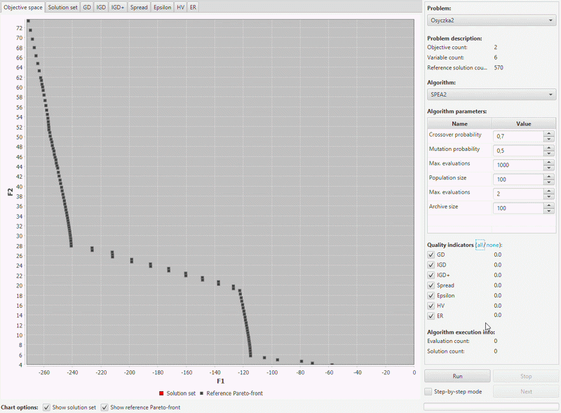
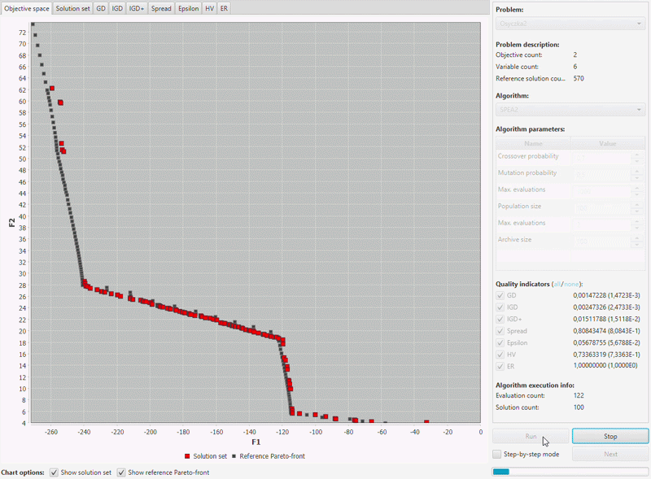
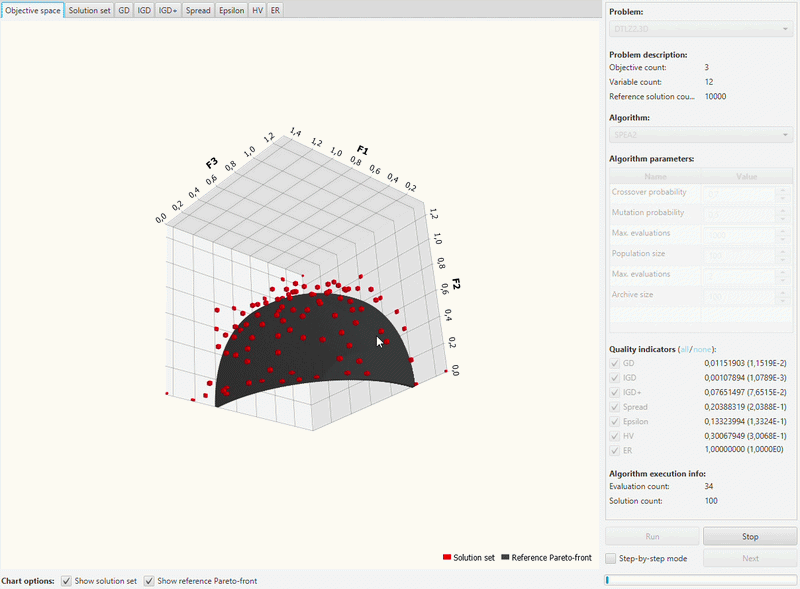

# jMetalator - jMetal 5.5 Simulator (Legacy)

Simulator for multi-objective evolutionary optimization, developed during my Ph.D. studies at the Systems Research Institute, Polish Academy of Sciences

## Available features
### Problem, algorithm, parameters and quality indictators selection

### 2D Pareto-front visualization

### Step-by-step execution and solution set preview
\

### Quality indicator visualization

### 3D Pareto-front visualization

### nD Pareto-front visualization

## jMetal 5.5 Modifications
### Monitoring the Current Solution Set

The simulator is based on jMetal 5.5, with extensions I introduced to support monitoring the current solution set during the execution of evolutionary algorithms.

Two changes were introduced:

#### Extended `AbstractEvolutionaryAlgorithm`
The original `AbstractEvolutionaryAlgorithm` class was extended with a receiver mechanism that allows external components to subscribe to the current solution set.

Registered receivers are notified after each iteration of the algorithm. This makes it possible to track the evolution of the population during the optimization process.

#### Added `CurrentSolutionSetReceiver`
A new `CurrentSolutionSetReceiver` interface was introduced. Components interested in monitoring the optimization process can implement this interface and subscribe to an evolutionary algorithm instance.

This mechanism is used by jMetalator to provide step-by-step tracking and visualization of the evolving solution set.

### Modified SPEA2 Implementation
The original jMetal 5.5 implementation of SPEA2 uses the population size as the size of its archive. To provide more flexibility when configuring the algorithm, the SPEA2 implementation (`SPEA2` and `SPEA2Builder` classes) was modified to allow the archive size to be specified independently from the population size.

## Stack
### Back 
Java JDK 1.8.0_152, modified jMetal 5.5 (https://github.com/jMetal)

### Front
JavaFX, JFree/Orson charts (https://github.com/jfree) 
